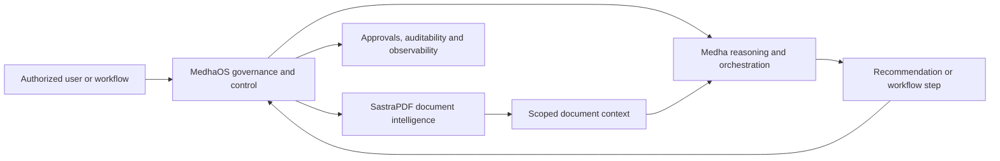

# Sastra Product Stack

Sastra's public product stack consists of Medha, MedhaOS and SastraPDF. The products are designed to work together for governed enterprise AI and document workflows while keeping their responsibilities separate.

## Product Roles

| Product | Primary responsibility | Boundary |
| --- | --- | --- |
| Medha | Intelligence, reasoning, retrieval-augmented generation, semantic retrieval, persistent context, model routing and workflow assistance. | Medha is not the governance layer and should not be treated as a standalone control plane. |
| MedhaOS | Identity, RBAC, tenant isolation, privacy controls, policy enforcement, approvals, auditability, observability, model routing and controlled execution. | MedhaOS is not the reasoning engine; it governs and controls execution. |
| SastraPDF | Document intelligence and workflow operations across extraction, review, transformation, processing and governed document actions. | SastraPDF is not merely a file utility; it applies intelligence and controls to document-heavy work. |

## How The Products Relate

The stack separates data, intelligence, governance and document actions:

- SastraPDF works with documents and document operations.
- Medha interprets context, retrieves relevant knowledge and assists with reasoning.
- MedhaOS governs who can do what, under which policy, with what approvals and auditability.
- Enterprise systems provide source data, identity signals, records and workflow destinations.

This diagram is conceptual. It does not describe internal infrastructure topology, deployment configuration or proprietary implementation details.

## Responsibility Boundaries

Medha begins with the reasoning problem: what information is relevant, how context should be interpreted, which model path is appropriate and how an AI-assisted workflow should proceed.

MedhaOS begins with operational control: who is requesting an action, which tenant or boundary applies, what policies apply, whether approval is required and how the action is recorded.

SastraPDF begins with document work: extraction, review, transformation, comparison, redaction, routing, signing, processing and other governed document actions.

The boundaries are important because enterprise AI systems need both capability and control. Intelligence without governance is difficult to operate safely. Governance without intelligence does not solve the reasoning problem. Document tools without workflow context often remain disconnected from business decisions.

## Conceptual Integrated Workflow

A representative governed document review flow could work as follows:

1. An authorized user submits a document set for review through a governed workflow.
2. MedhaOS validates identity, tenant scope, permissions and applicable policy.
3. SastraPDF extracts document content, structure, metadata and review targets.
4. Medha retrieves relevant knowledge and generates contextual recommendations.
5. MedhaOS determines whether a recommendation can be shown, routed, approved or executed.
6. A human reviewer approves, rejects or edits sensitive actions.
7. The system records the decision path for auditability and observability.

This is a reference workflow, not a claim of a completed deployment.

## Adoption Patterns

Organizations may evaluate the products independently or together:

- Medha may be evaluated for governed reasoning, retrieval and orchestration patterns.
- MedhaOS may be evaluated for AI governance, policy enforcement, identity-aware controls and observability.
- SastraPDF may be evaluated for document intelligence and document workflow automation.
- The combined stack may be evaluated for document-heavy enterprise workflows that require both AI reasoning and controlled execution.

## Related Documentation

- [Features overview](features-overview.md)
- [Cross-product use cases](cross-product-use-cases.md)
- [Architecture principles](architecture-principles.md)
- [Governed knowledge assistant reference architecture](../reference-architectures/governed-knowledge-assistant.md)
- [Governed document processing reference architecture](../reference-architectures/governed-document-processing.md)
