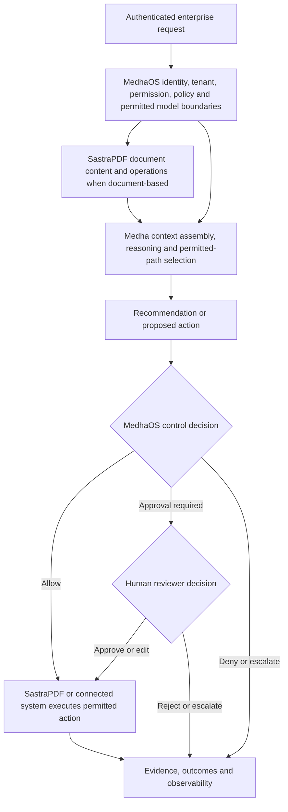

# Sastra Product Stack

Sastra's public product stack consists of Medha, MedhaOS and SastraPDF. The products are designed to work together for governed enterprise AI and document workflows while keeping their responsibilities separate.

## Product Roles

| Product | Primary responsibility | Boundary |
| --- | --- | --- |
| [Medha](https://github.com/sastra-innovations/medha-public-docs) | Reasoning and orchestration, retrieval and context assembly, persistent context, semantic retrieval, semantic caching, task-aware model selection and workflow assistance. | Medha is not the governance layer and should not be treated as a standalone control plane. It selects an appropriate model path from the set permitted by MedhaOS. |
| [MedhaOS](https://github.com/sastra-innovations/medha-os-public-docs) | Identity and access boundaries, RBAC, tenant isolation, policy evaluation and enforcement boundaries, approved model and provider paths, approvals, auditability, observability and controlled execution. | MedhaOS is not the reasoning engine and does not perform every business operation. It governs and controls execution boundaries. |
| [SastraPDF](https://github.com/sastra-innovations/sastrapdf-public-docs) | Document ingestion, viewing, navigation, editing, extraction, transformation, collaboration, review and document-workflow execution. | SastraPDF is not merely a file utility. The current public feature catalogue documents 119 distinct document operations with defined status labels and counting rules. |

## How The Products Relate

The stack separates data, intelligence, governance and document actions:

- SastraPDF works with documents and document operations.
- Medha interprets context, retrieves relevant knowledge, selects within MedhaOS-permitted model paths and assists with reasoning.
- MedhaOS governs who can do what, under which policy, through which approved model and provider boundaries, with what approvals and auditability.
- Enterprise systems provide source data, identity signals, records and workflow destinations.

This diagram is conceptual. It does not describe internal infrastructure topology, deployment configuration or proprietary implementation details.

## Responsibility Boundaries

Medha begins with the reasoning problem: what information is relevant, how context should be interpreted, which permitted model path is appropriate and how an AI-assisted workflow should proceed.

MedhaOS begins with operational control: who is requesting an action, which tenant or boundary applies, what policies apply, which model and provider paths are permitted, whether approval is required and how the action is recorded.

SastraPDF begins with document work: ingestion, viewing, editing, extraction, review, transformation, comparison, redaction, routing, signing, collaboration, processing and other governed document actions.

The boundaries are important because enterprise AI systems need both capability and control. Intelligence without governance is difficult to operate safely. Governance without intelligence does not solve the reasoning problem. Document tools without workflow context often remain disconnected from business decisions.

## Conceptual Integrated Workflow

A representative governed document review flow could work as follows:

1. An authorized user submits a document set for review through a governed workflow.
2. MedhaOS validates identity, tenant scope, permissions, applicable policy and permitted model or provider boundaries.
3. SastraPDF extracts document content, structure, metadata and review targets.
4. Medha assembles context, retrieves relevant knowledge, selects within the MedhaOS-permitted model set and generates contextual recommendations.
5. MedhaOS determines whether a recommendation can be shown, routed, approved or executed.
6. A human reviewer approves, rejects, escalates or edits sensitive actions when required.
7. The system records the decision path for auditability and observability.

This is a reference workflow, not a claim of a completed deployment.

## Adoption Patterns

Organizations may evaluate the products independently or together:

- Medha may be evaluated for governed reasoning, retrieval, context continuity, semantic caching and orchestration patterns.
- MedhaOS may be evaluated for AI governance, policy evaluation and enforcement boundaries, identity-aware controls and observability.
- SastraPDF may be evaluated for document intelligence, collaborative editing and document workflow automation.
- The combined stack may be evaluated for document-heavy enterprise workflows that require both AI reasoning and controlled execution.

## Related Documentation

- [Features overview](features-overview.md)
- [Cross-product use cases](cross-product-use-cases.md)
- [Architecture principles](architecture-principles.md)
- [Medha public documentation](https://github.com/sastra-innovations/medha-public-docs)
- [MedhaOS public documentation](https://github.com/sastra-innovations/medha-os-public-docs)
- [SastraPDF public documentation](https://github.com/sastra-innovations/sastrapdf-public-docs)
- [SastraPDF feature catalogue](https://github.com/sastra-innovations/sastrapdf-public-docs/blob/main/docs/features/feature-catalogue.md)
- [Governed knowledge assistant reference architecture](../reference-architectures/governed-knowledge-assistant.md)
- [Governed document processing reference architecture](../reference-architectures/governed-document-processing.md)
