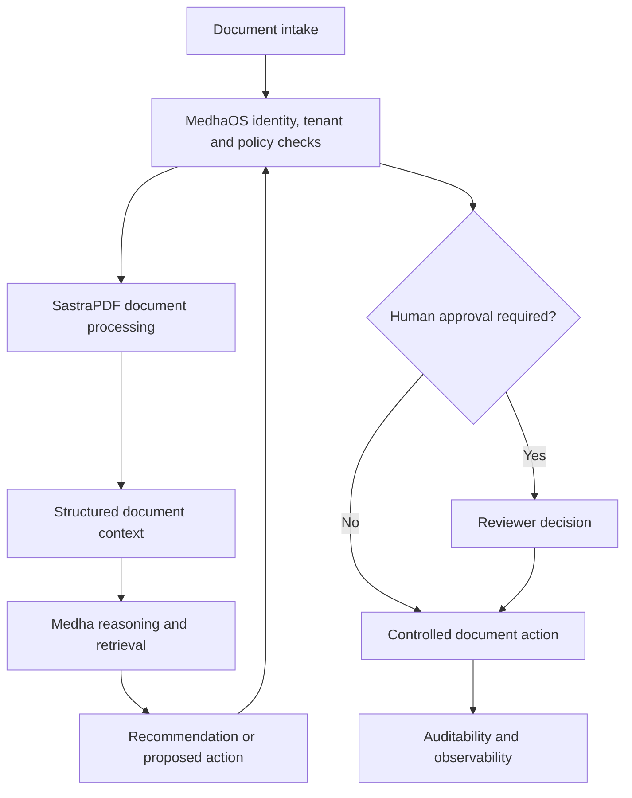

# Governed Document Processing Reference Architecture

This reference architecture describes a conceptual governed document-processing workflow using SastraPDF, Medha and MedhaOS. It is intended for document-heavy review, transformation and approval workflows.

## Purpose

The pattern helps organizations evaluate document intelligence where extraction, review, reasoning and controlled document actions must operate under identity, policy, approval and audit boundaries.

## Conceptual Architecture

The architecture is conceptual and excludes deployment topology, credentials, ports, private hostnames and proprietary implementation details.

## Conceptual Workflow

1. Documents enter a scoped workflow.
2. MedhaOS checks identity, tenant, permission and applicable policy.
3. SastraPDF extracts, reviews, compares, transforms or prepares document content.
4. Medha retrieves relevant context and generates recommendations when useful.
5. MedhaOS determines whether the action is allowed, blocked or routed for approval.
6. Reviewers approve, edit or reject sensitive actions.
7. Approved document actions are executed and recorded.

## Governance Controls

- RBAC and least-privilege access
- Tenant and document-boundary isolation
- Sensitive-data controls
- Policy-controlled document actions
- Human approval for high-impact steps
- Audit trails for decisions and actions
- Observability for workflow behavior

## Suitable Evaluation Scenarios

- Governed document review
- Contract or policy processing
- Redaction and release workflows
- Approval-controlled signing or routing
- Multi-tenant document intelligence

## Related Documentation

- [Cross-product use cases](../docs/cross-product-use-cases.md)
- [AI-native document workflows whitepaper](../whitepapers/ai-native-document-workflows.md)
- [SastraPDF official page](https://sastra.io/products/sastrapdf)
