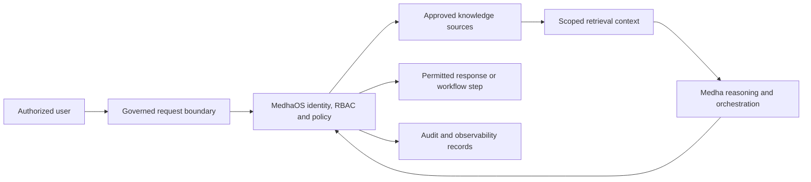

# Governed Knowledge Assistant Reference Architecture

This reference architecture describes a conceptual governed knowledge assistant using Medha and MedhaOS, with SastraPDF included when knowledge sources are document-heavy. It is intended for enterprise retrieval and workflow-assistance discussions.

## Purpose

The pattern helps organizations evaluate AI-assisted knowledge retrieval without allowing unrestricted context access. It emphasizes identity, RBAC, tenant isolation, trusted context, policy evaluation and auditability.

## Conceptual Architecture

This diagram is not an infrastructure topology. It omits internal services, network paths, storage details, ports and security configuration.

## Conceptual Workflow

1. A user asks a knowledge or workflow question.
2. MedhaOS evaluates identity, role, tenant and policy.
3. Approved sources are selected according to scope.
4. Medha performs semantic retrieval and reasoning over permitted context.
5. MedhaOS applies response policy and records the decision path.
6. The user receives an answer, recommendation or governed next step.

## Governance Controls

- Identity before retrieval
- Role and tenant scoping
- Trusted source selection
- Policy checks before response or action
- Human approval for sensitive next steps
- Auditability and observability

## Evaluation Considerations

Enterprise teams should define source boundaries, allowed data classes, approval thresholds, logging expectations and model-routing constraints before piloting this pattern.

## Related Documentation

- [Product stack](../docs/product-stack.md)
- [Architecture principles](../docs/architecture-principles.md)
- [Governed enterprise AI whitepaper](../whitepapers/governed-enterprise-ai.md)
