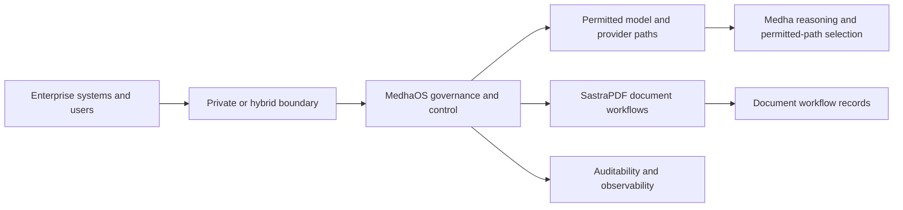

# Private Or Hybrid AI Deployment Reference Architecture

This reference architecture describes conceptual private and hybrid deployment patterns for governed enterprise AI workflows. It is intended for evaluation planning and does not disclose internal infrastructure topology or security-sensitive configurations.

## Purpose

Some organizations need AI workflows to operate within private or hybrid boundaries because of data sensitivity, operating policy, integration requirements or review obligations. This pattern explains how Medha, MedhaOS and SastraPDF can be discussed in that context at a public, conceptual level.

## Conceptual Architecture

This diagram does not specify hosts, network segments, ports, vendors, credentials, data stores or implementation-specific controls.

## Conceptual Workflow

1. The organization defines data classes, workflow boundaries and approved integration surfaces.
2. MedhaOS enforces identity, tenant, policy, permitted model or provider paths, approval and audit requirements.
3. Medha selects an appropriate reasoning path from the set permitted by MedhaOS.
4. SastraPDF handles document operations within the selected deployment boundary.
5. Observability and audit records support internal review and hardening.

## Governance Controls

- Identity and RBAC
- Tenant isolation
- Data minimization
- Policy-controlled execution
- Approved model and provider path governance
- Human approvals
- Auditability and observability
- Organization-specific security review

## Evaluation Considerations

Private or hybrid fit should be evaluated against workflow criticality, data sensitivity, latency requirements, integration complexity, review obligations and operational ownership. This repository does not provide deployment runbooks or environment-specific configurations.

## Related Documentation

- [Architecture principles](../docs/architecture-principles.md)
- [Governed enterprise AI whitepaper](../whitepapers/governed-enterprise-ai.md)
- [Product status](../docs/product-status.md)
- [Medha public documentation](https://github.com/sastra-innovations/medha-public-docs)
- [MedhaOS public documentation](https://github.com/sastra-innovations/medha-os-public-docs)
- [SastraPDF public documentation](https://github.com/sastra-innovations/sastrapdf-public-docs)
