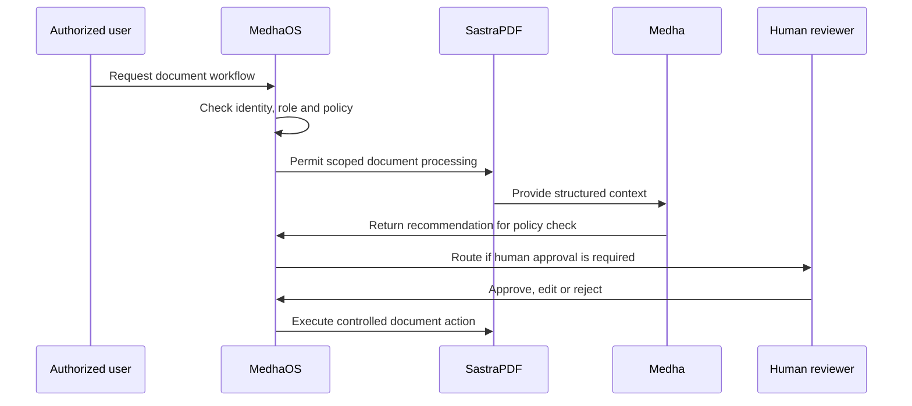

# AI-Native Document Workflows

Document-heavy enterprises often need more than storage, search or file editing. They need governed workflows that can understand document content, preserve business context, route sensitive actions and keep humans accountable.

## Executive Summary

AI-native document workflows combine document intelligence, reasoning and governance:

- SastraPDF handles document extraction, review, transformation, processing and governed document actions.
- Medha adds semantic retrieval, contextual reasoning and workflow assistance.
- MedhaOS controls identity, policy, approvals, auditability and observability.

The result is a reference approach for document-heavy work where AI assists the process but does not remove operational control.

## From File Operations To Workflow Intelligence

Traditional document tools often focus on individual file operations. Enterprise workflows usually require a broader operating model:

- Extract content and metadata from documents.
- Compare, review, redact or transform documents.
- Retrieve relevant policy, contract or knowledge context.
- Generate recommendations for reviewers.
- Route sensitive steps for approval.
- Record actions and decisions for later review.

SastraPDF is positioned for document intelligence and workflow operations rather than basic editing alone.

## Reference Workflow Pattern

This pattern is conceptual and does not expose internal deployment topology or implementation details.

## Representative Workflow Areas

| Area | Example pattern |
| --- | --- |
| Document extraction | Extract text, sections, entities, tables or metadata for review. |
| Document review | Assist reviewers with context, summaries, comparisons and recommendations. |
| Document transformation | Convert, redact, route, sign or prepare documents under policy control. |
| Knowledge retrieval | Retrieve relevant enterprise knowledge for document-specific questions. |
| Approval-controlled actions | Require human approval before sensitive document operations execute. |
| Multi-tenant workflows | Preserve tenant or business-unit separation for document context and actions. |

## Governance Requirements

AI-native document workflows should account for:

- Identity and RBAC
- Tenant isolation
- Sensitive-data handling
- Policy-controlled document actions
- Approval routing
- Audit trails
- Observability
- Deployment boundaries

## Related Documentation

- [Cross-product use cases](../docs/cross-product-use-cases.md)
- [Governed document processing reference architecture](../reference-architectures/governed-document-processing.md)
- [Product status](../docs/product-status.md)
- [SastraPDF official page](https://sastra.io/products/sastrapdf)
