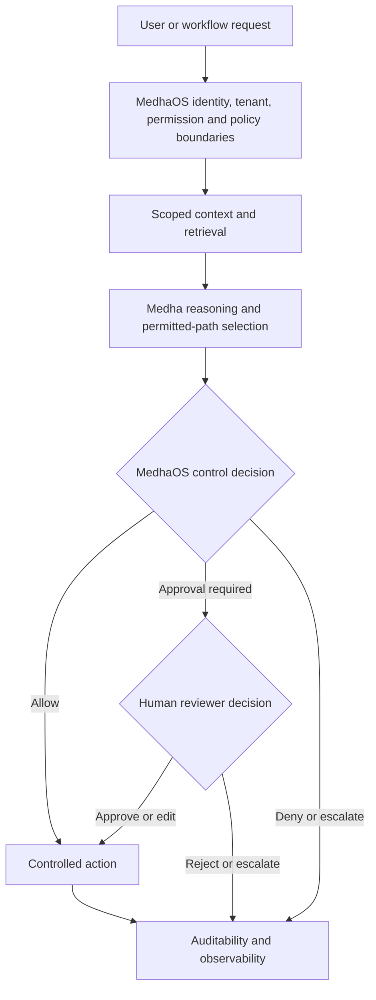

# Governed Enterprise AI

Enterprise AI adoption is not only a model-selection problem. For many organizations, the harder problem is how to make AI useful inside workflows that require identity, privacy, permissions, context control, auditability and human accountability.

## Executive Summary

Sastra's product stack separates intelligence from governance and workflow execution:

- Medha provides reasoning, retrieval, context handling, task-aware model selection and orchestration.
- MedhaOS provides identity-aware governance, policy evaluation and enforcement boundaries, approvals, auditability and observability.
- SastraPDF applies intelligence and controls to document-heavy workflows.

This separation allows organizations to evaluate AI capability and operational control together without merging their responsibilities.

## Why Governance Matters

Enterprise AI systems may touch confidential documents, internal knowledge, operational decisions, approvals and regulated business processes. A useful architecture should answer practical questions before an AI-assisted action occurs:

- Who is making the request?
- Which tenant, workspace or data boundary applies?
- What sources and context are allowed?
- Which model path is approved?
- Does the action require human approval?
- How will the decision and action be reviewed later?

## Public Reference Model

This reference model is conceptual. It does not describe internal infrastructure, private network paths, credentials, ports, service names or proprietary implementation details.

## Key Principles

**Identity before execution:** AI requests should be tied to an actor, role and operating boundary before context or tools are exposed.

**Scoped context:** Retrieval should respect data permissions, provenance, tenant boundaries and purpose.

**Policy-controlled actions:** Recommendations and workflow actions should be checked against policy before execution. Denied or escalated requests should not proceed directly to controlled actions.

**Human approval:** Sensitive actions should preserve human review, escalation and decision ownership.

**Auditability and observability:** Teams should be able to review what happened, why it happened and which controls were applied.

**Model flexibility:** Enterprises may need different model paths for different workflows, data classes or deployment requirements. Medha selects an appropriate path for the task from the set permitted by MedhaOS.

## Evaluation Questions

Enterprise teams evaluating governed AI-native systems should ask:

- Which workflow decisions require human approval?
- Which sources may be retrieved for each role?
- Which document actions should be blocked, routed or logged?
- What audit evidence is needed for internal review?
- Which model and provider paths are acceptable for each data class?
- What deployment boundary is appropriate for sensitive workflows?

## Related Documentation

- [Architecture principles](../docs/architecture-principles.md)
- [Product stack](../docs/product-stack.md)
- [Medha public documentation](https://github.com/sastra-innovations/medha-public-docs)
- [MedhaOS public documentation](https://github.com/sastra-innovations/medha-os-public-docs)
- [SastraPDF public documentation](https://github.com/sastra-innovations/sastrapdf-public-docs)
- [Governed knowledge assistant reference architecture](../reference-architectures/governed-knowledge-assistant.md)
- [Private or hybrid AI deployment reference architecture](../reference-architectures/private-hybrid-ai-deployment.md)
